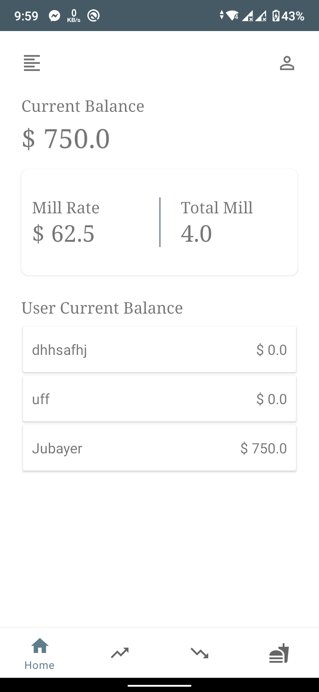
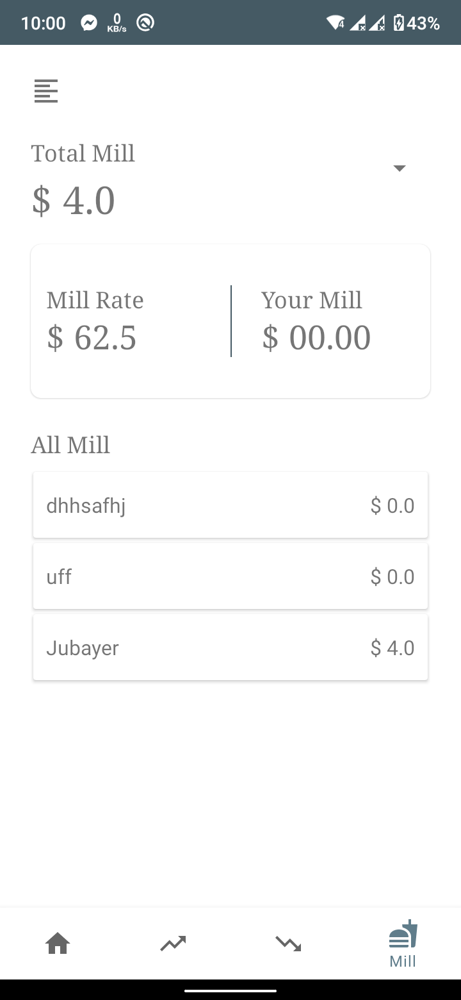

# Mill-Management-With-Firestore
#This is a very basic Mill Management System with Firestore.
#Login Design Inspire from https://dribbble.com/shots/9193852-DailyUI-001-Signup-Free-Download this guy
#If You Want to use it just download json file from your firebase console and past it.then for email verification go to Authentication section in your firebase enable email verification thats all.
#Technology Use:::Navigation Component,Live Data,View Model.For Animation ::Constraint Layout with Constraint Set(very basic motion animation ,Not Fully implement Nikhil Animation Design)

<!-- First row -->

  
  
  

<!-- Second row -->

  
  
  

